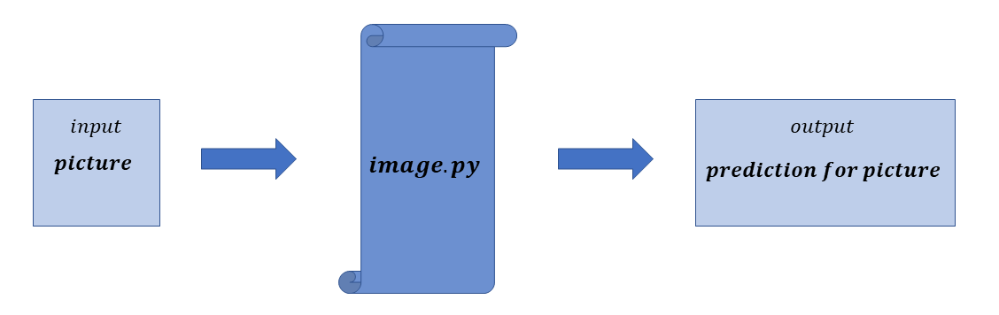

# Tensor Flow
# General info
one-dimensional neural network for image recognition

# Description
One-dimensional neural network based on Tensor Flow library: https://www.tensorflow.org/
Training data import from MNIST databases. The categories (classes) in
which the program is able to classify the object in the picture: 
{T-shirt, Trouser, Pullover, Dress, Coat, Sandal, Shirt, Sneakre, Bag, Ankle boot)}

# Run
image.py takes 'photos.png' as a input and returns prediction. 
Simple test is an option '2' = 'series' and number of image 'i = 7' (then image.py takes example photo from /picture. 
More info is in documentation.pdf

  

# Technologies
Project has been created in Python 3.7.5. Main libraries:
* Tensor Flow: 2.0.0
* PIL: 6.2.1 - Python Imaging Library
* Numpy: 1.17.4
* Matplotlib 3.1.1
